# PetMate
PetMate é uma plataforma que facilita a adoção e doação de pets.

## Integrantes👨‍💻👩‍💻
- [johan-akn](https://github.com/johan-akn) - Full Stack
- [isadauzaker](https://github.com/isadauzaker) - Full Stack
- [Emi-Souza](https://github.com/Emi-Souza) - Full Stack
- [Gucrima](https://github.com/Gucrima) - Full Stack
- [josehvinii](https://github.com/josehvinii) - Full Stack

## Requisitos Funcionais 📋

- RF01: O sistema deve permitir o cadastro, edição e exclusão de contas de usuários e ONGs.

- RF02: O sistema deve permitir o cadastro, edição e exclusão de pets disponíveis para adoção.

- RF03: O sistema deve permitir a busca de pets utilizando filtros como espécie, porte e gênero.

- RF04: O sistema deve disponibilizar uma barra de pesquisa para facilitar a localização de ONGs.

- RF05: O sistema deve permitir que usuários adicionem pets aos favoritos.

- RF06: O sistema deve permitir que usuários publiquem comentários sobre o funcionamento da plataforma.

- RF07: O sistema deve permitir que usuários denunciem ONGs ou pets cadastrados, quando necessário.

- RF08: O sistema deve possibilitar o redirecionamento do usuário para contato via WhatsApp e/ou e-mail com o responsável pelo pet.

- RF09: O sistema deve permitir que o usuário visualize a localização do pet no Google Maps.

- RF10: O sistema deve permitir que o usuário redefina sua senha por meio de código de verificação enviado por e-mail.

- RF11: O sistema deve oferecer um painel administrativo com funcionalidades de gerenciamento, incluindo:
 - Visualização de dados detalhados de usuários, pets e ONGs;
 - Edição e exclusão de registros de usuários, pets e ONGs. 

## Distribuição de Responsabilidades 📝

- RF01: Johan Akin Araujo da Silva Rodrigues
- RF02: Emilly Lima de Souza
- RF03: Johan Akin Araujo da Silva Rodrigues
- RF04: José Vinicius Victor Dauzaker
- RF05: Isadora Victor Dauzaker
- RF06: José e Isadora
- RF07: Gustavo Soares Franco
- RF08: Johan Akin Araujo da Silva Rodrigues
- RF09: Gustavo e Emilly
- RF10: Johan Akin Araujo da Silva Rodrigues
- RF11: Gustavo e Johan
  
### [Documentação](https://docs.google.com/document/d/1TBU8-_BPHwepaxgek6Jtyi0G4E04BuEELcBfpENMvl4/edit?tab=t.0)
### Redes Sociais 🖥️

### [Protótipos das Telas](https://www.figma.com/design/YRC8YzLZYwYbdF6OqDJS6x/SA-PETMATE?node-id=0-1&p=f&t=5ulL8xjbUlvHqR8s-0)
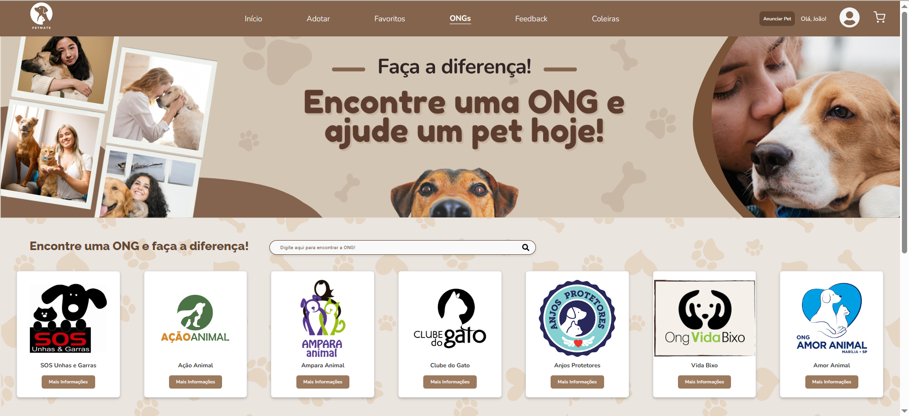
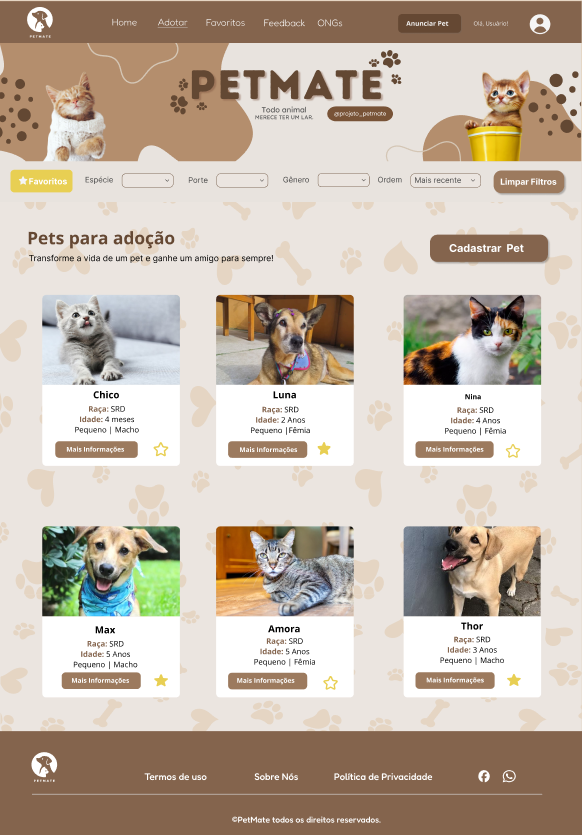
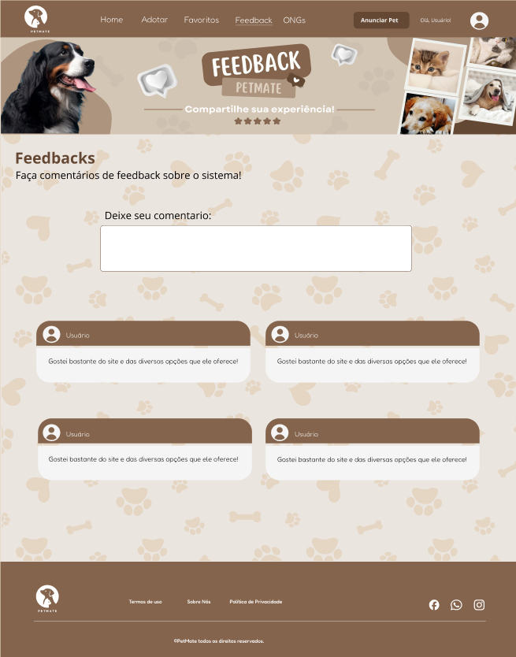
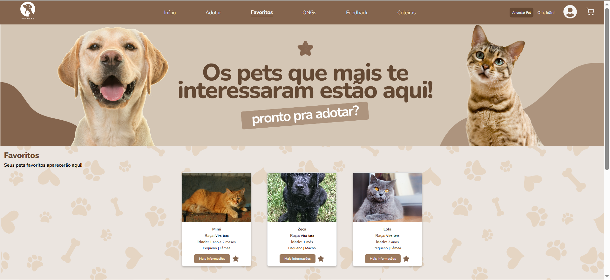
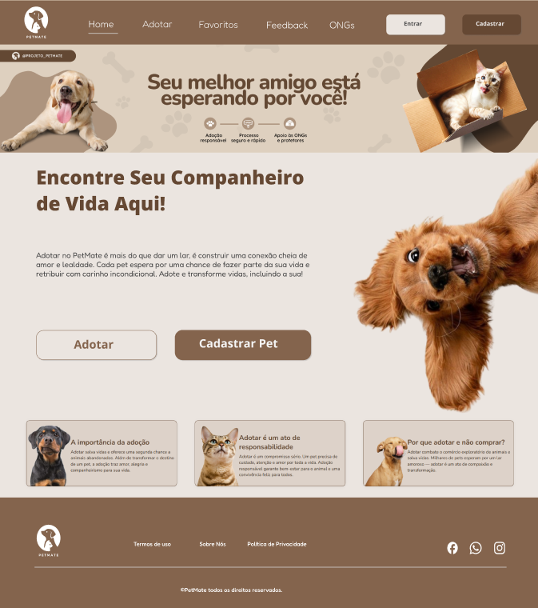
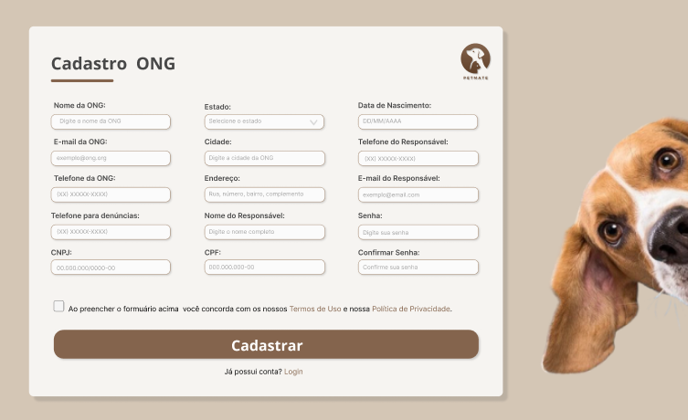
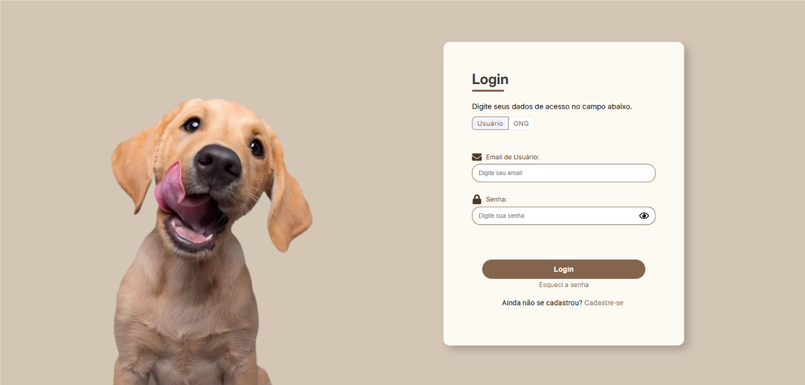
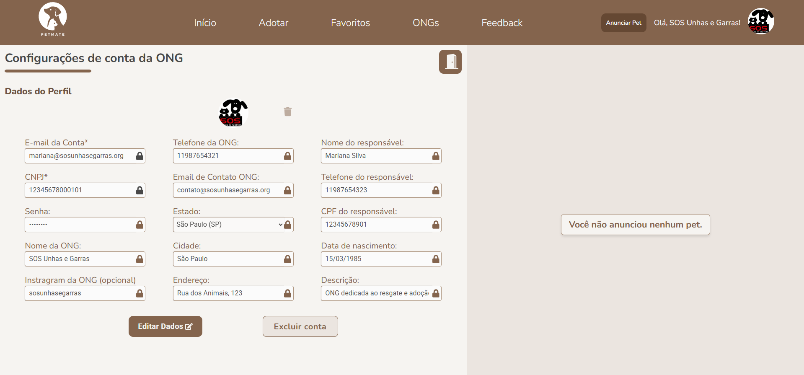
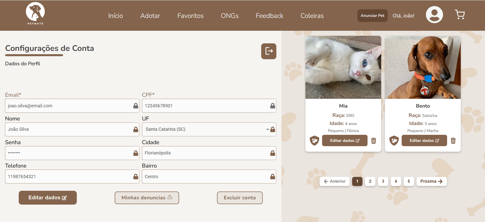
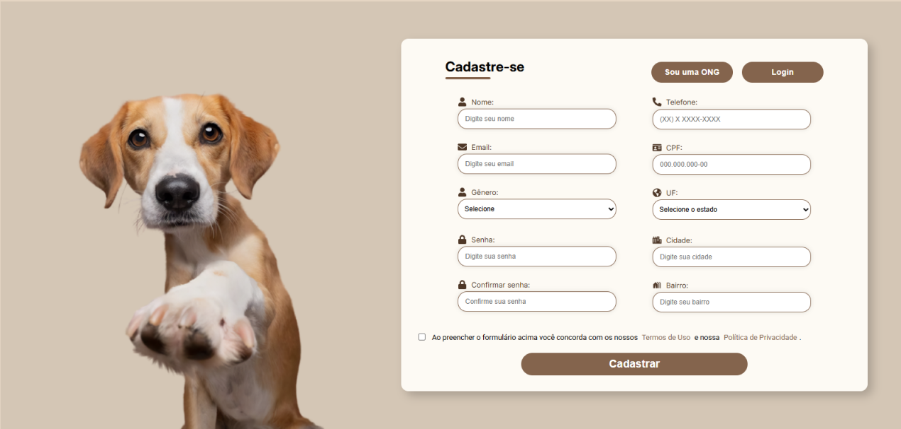
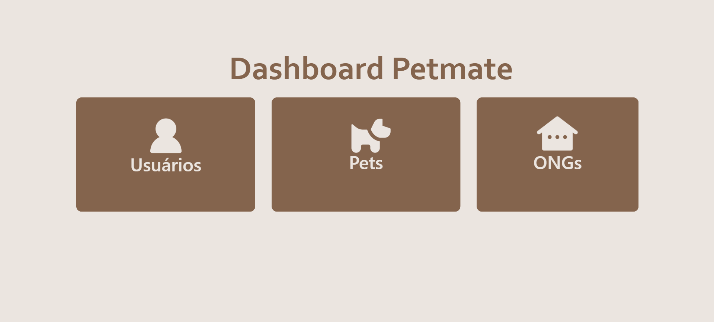
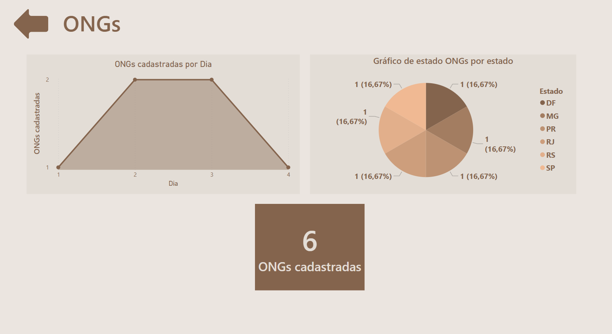
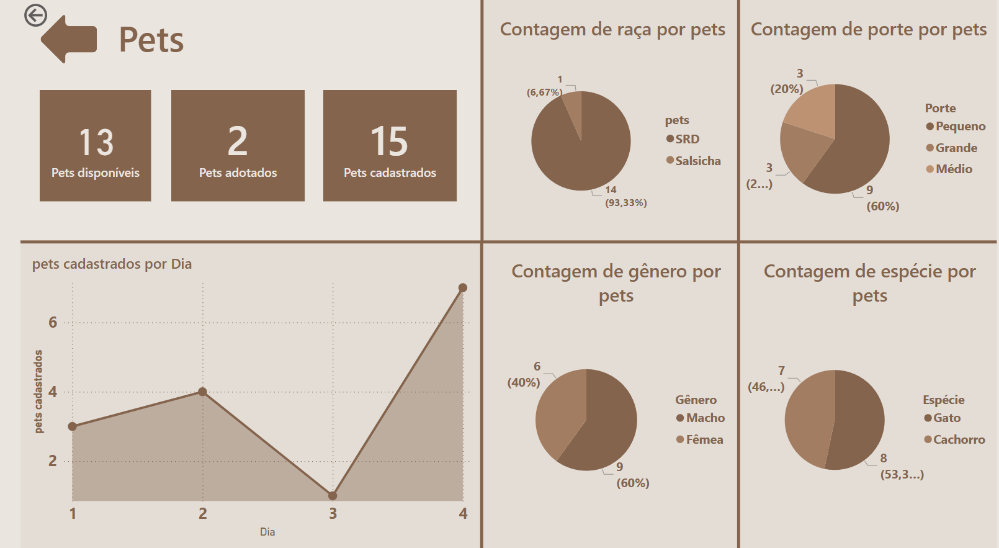
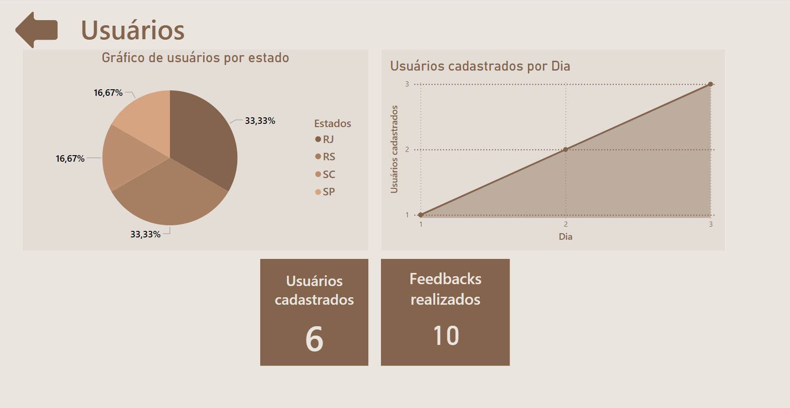
