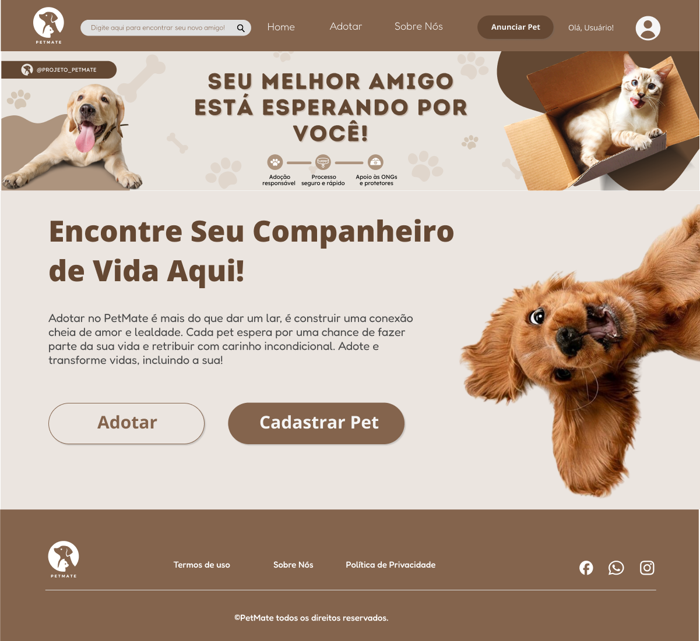
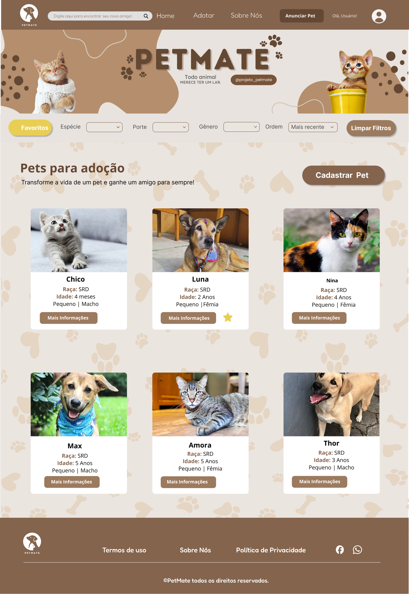
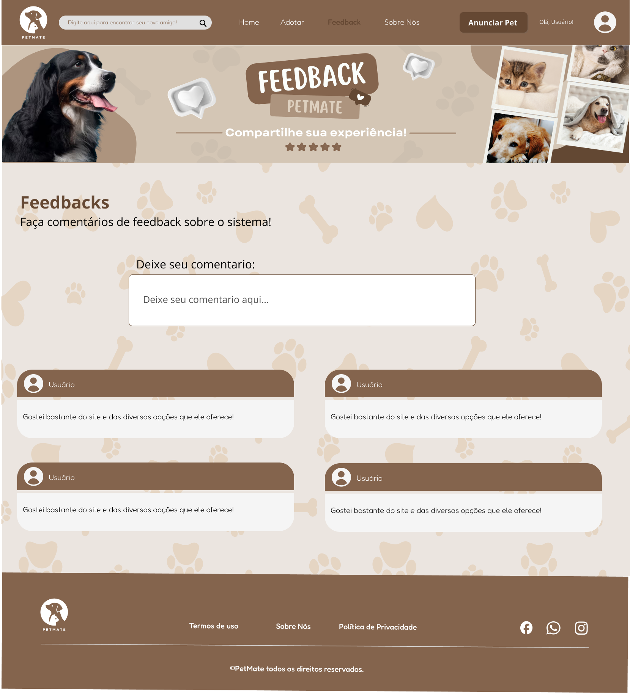
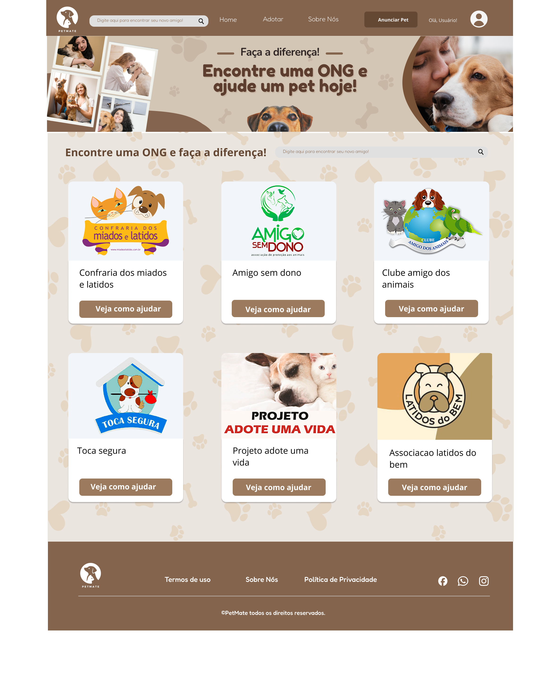

# PetMate
PetMate é uma plataforma que facilita a adoção e doação de pets.

## Integrantes👨‍💻👩‍💻
- [johan-akn](https://github.com/johan-akn) - Frontend e Backend
- [isadauzaker](https://github.com/isadauzaker) - Frontend e Backend
- [Emi-Souza](https://github.com/Emi-Souza) - Frontend e Backend
- [Gucrima](https://github.com/Gucrima) - Frontend e Backend
- [josehvinii](https://github.com/josehvinii) - Frontend e Backend

## Requisitos Funcionais 📋

- RF01: O sistema deve permitir que usuários realizem o cadastro, edição e exclusão de suas contas.
- RF02: O sistema deve permitir o cadastro, edição e remoção de animais disponíveis para adoção.
- RF03: O sistema deve permitir a busca de animais para adoção por meio de filtros.
- RF04: O sistema deve permitir que usuários favoritem animais de interesse.
- RF05: O sistema deve disponibilizar uma barra de pesquisa para encontrar rapidamente pets ou usuários.
- RF06: O sistema deve permitir que usuários realizem comentários sobre o sistema.
- RF07: O sistema deve disponibilizar contato com ONGS para contribuição e denúncias. 
- RF08: O sistema deve permitir que ONGS também possam colocar pets para adoção.

## Integrantes designados para cada função 📝

- RF01: Emilly Lima de Souza
- RF02: Johan Akin Araujo da Silva Rodrigues
- RF03: Johan Akin Araujo da Silva Rodrigues
- RF04: Isadora Victor Dauzaker
- RF05: José Vinicius Victor Dauzaker
- RF06: José e Isadora
- RF07: Gustavo Soares Franco
- RF08: Gustavo e Emilly
  
### [Documentação](https://docs.google.com/document/d/1TBU8-_BPHwepaxgek6Jtyi0G4E04BuEELcBfpENMvl4/edit?tab=t.0)
### Redes Sociais 🖥️

### [Protótipos de Tela](https://www.figma.com/design/I4YY1hYlPScfRid7A6kSqP/SA-3a-Fase?node-id=0-1&t=hwEC0SaAc0CZ9Y58-1)

